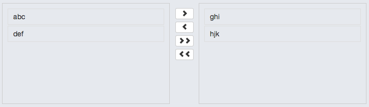

Multiselect Directive
=============================

Multiselect Directive for AngularJS Apps

### Usage: 

* Add __ui.multiselect__ module as a dependency to your angularjs module.
* In the html add the following: 

  ```html
  <multselect left-list="leftListVar" right-list="rightListVar"></multiselect>
  ```
  
### Screenshot:



Equals Directive
================

Equals directive for AngularJS apps.
This directive can be used to equate two fields on a form and sets the validity to false if they are not equal.

### Usage:

* Add _ui.equals_ module as a dependency to your angularjs module.
* Add attribute _equals_ to any form tag passing the model of the field against which it should be equated. See below example.

  ```html
  <div>
  <form name="form">
    <input type="password" name="password" id="password" ng-model="user.password" required>
    <input type="password" name="confPassword" id="confPassword" ng-model="user.confirmPassword" 
    	equals="{{ user.password }}" required>
	  <div ng-show="form.confPassword.$dirty &amp;&amp; form.confPassword.$invalid">
		  <span ng-show="form.confPassword.$error.required">Confirm your password.</span>
		  <span ng-show="form.confPassword.$error.notEqual">Passwords do not match.</span>
	  </div>
  </form>
  </div>
  ```
